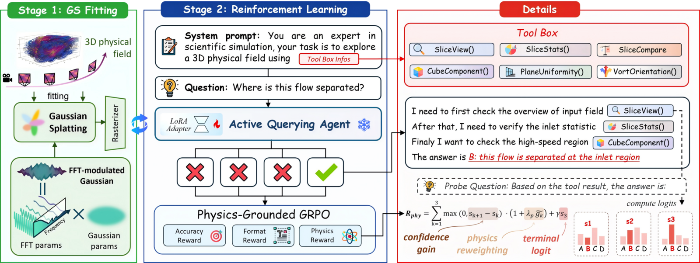

# AQUA

**Tool-Augmented GRPO Training for 3D Fluid Field Question Answering**

AQUA is a tool-calling GRPO training framework for 3D physical field question answering.

It connects QA data, fluid analysis tools, and 3DGS slice rendering into a single rollout. The goal is not to let the model "guess answers from images", but to have it plan first, call tools, then produce an answer.

<p align="center">
  
</p>
<p align="center"><b>Figure:</b> AQUA pipeline overview. Stage 1: Convert raw mesh data into a queryable Gaussian Splatting environment. Stage 2: Train a vision-language agent using Physics-Grounded GRPO to answer questions by iteratively querying the 3DGS environment.</p>

> **Status:** Research code. Depends on local environment, model weights, and data paths. Suitable for reading the implementation and building upon it.

## Training Protocol

During training, the model follows a fixed protocol for each sample:

```text
question
  -> reasoning steps
  -> query_plan
  -> tool calls
  -> tool results
  -> final_answer
```

The process consists of three rounds:

1. Output brief reasoning steps without giving the answer directly.
2. Output a `query_plan` JSON declaring which tools to call.
3. Execute tools at runtime, write results back into context, and the model outputs a `final_answer` JSON.

The focus is not on "visual QA" but on "completing verifiable fluid analysis with tool assistance".

## Main Files

```text
AQUA/
├── real_fluid_grpo.py        # Training entry point
├── grpo_rollout.py           # Rollout runtime
├── grpo_tools.py             # Tool schemas and executors
├── grpo_trainer.py           # Custom GRPOTrainer wrapper
├── grpo_data.py              # Dataset loading and prompt mapping
├── grpo_parsing.py           # Model output parsing (JSON extraction)
├── grpo_rewards.py           # Reward functions
├── grpo_runtime_flags.py     # Environment variable config switches
├── real_fluid_renderer.py    # 3DGS renderer adapter
├── gs/                       # Rendering code and CUDA extensions
├── dataset/                  # Dataset directory
└── train_qclr_boxturb.sh     # Training launch script
```

## Datasets

The project supports 4 datasets:

| Dataset | Description |
|---------|-------------|
| `boxTurb_tzxyc` | Box turbulence (default, 20 cases) |
| `hot_Room_tzxyc` | Hot room convection |
| `LES_tzxyc` | Large Eddy Simulation (including channel395, etc.) |
| `moto_tzxyc` | Motorcycle external flow |

Each dataset directory follows the same structure:

```text
dataset/<dataset_name>/
├── gs/                # Gaussian field files (*.h5 / *.hdf5)
└── QA/
    ├── cases/         # QA JSON files read directly during training
    ├── qa_common.py   # Question generation logic
    └── run_all_qa.py  # Batch QA generation script
```

The dataset files are large (~8 GB) and are not included in the Git repository. Please download from Baidu Netdisk and place them in the `dataset/` directory:

- **Download link:** https://pan.baidu.com/s/1o2DQtEP8RwYemMirTQvNDg?pwd=utri
- **Passcode:** `utri`

After downloading, the directory structure should be:

```text
AQUA/
└── dataset/
    ├── boxTurb_tzxyc/
    ├── hot_Room_tzxyc/
    ├── LES_tzxyc/
    └── moto_tzxyc/
```

It is recommended to explicitly pass `--dataset boxTurb_tzxyc` rather than relying on default paths in the code.

## Getting Started

### Requirements

- NVIDIA GPU required, 80 GB VRAM recommended (e.g., A800 / A100 80G)
- Training uses vLLM colocate mode + LoRA, can be launched on a single GPU
- Python 3.11, CUDA 12.x (must be compatible with `torch==2.9.0`)

### Installation

```bash
conda create -n aqua python=3.11
conda activate aqua
pip install -r requirements.txt
pip install -r gs/requirements.txt
pip install gs/submodules/diff-gaussian-rasterization-radar
```

### Model

Training is based on LoRA fine-tuning of [Qwen3-VL-4B-Instruct](https://huggingface.co/Qwen/Qwen3-VL-4B-Instruct). Download the model weights and specify the path via `--model-name`.

## Usage

Quick start:

```bash
python real_fluid_grpo.py --dataset boxTurb_tzxyc
```

Small-scale smoke test:

```bash
python real_fluid_grpo.py --dataset boxTurb_tzxyc --limit 8
```

Training script (with accelerate launch + heartbeat monitoring):

```bash
bash train_qclr_boxturb.sh
```

Full parameter list: `python real_fluid_grpo.py --help`

## Acknowledgments

The rendering implementation relies on the local `gs/` directory and its submodules. Some CUDA extensions and underlying implementations retain the original project's license and copyright notices. See `gs/` and its subdirectories for related license files.

## Citation

If this project is helpful to your research, please cite the following paper:

```bibtex
@inproceedings{gao2026aqua,
  title     = {From Compression to Exploration: Active Querying Agent for 3D Physical Field Understanding},
  author    = {Chonghan Gao},
  booktitle = {Proceedings of the 32nd ACM SIGKDD Conference on Knowledge Discovery and Data Mining (KDD)},
  year      = {2026},
  url       = {https://github.com/gaoch6258/AQUA}
}
```

## License

This project is licensed under the [MIT License](LICENSE). `gs/` and its subdirectories retain their own license notices.
